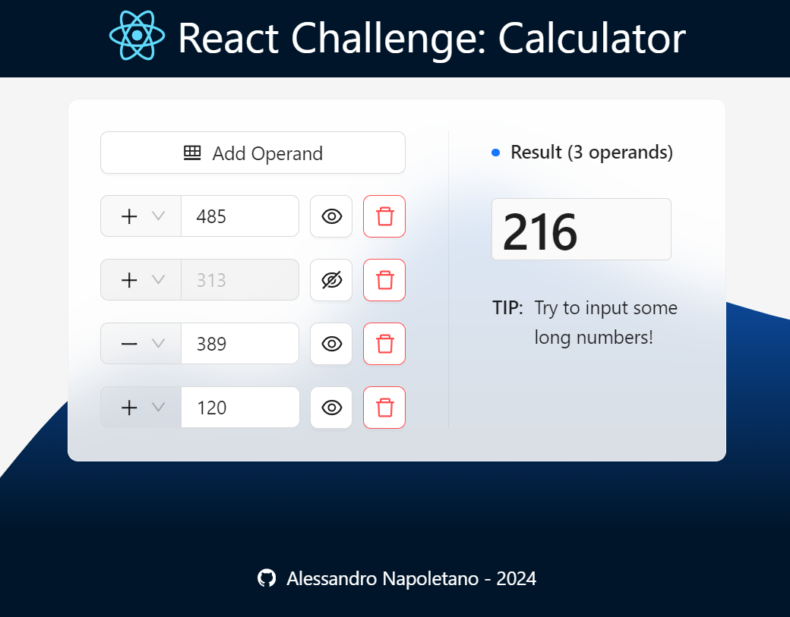

# React Challenge: Calculator

### Description

The program is a calculator that takes a number of rows (operands) and diplays the result.

It has the following functionalities:

- rows can be added and removed
- each row has a sign (minus or plus)
- each row can be enabled or disabled by a dedicated control button. Disabled rows are excluded from the addition.
- the result is updated "live" while the user is writing

### Libraries and Frameworks

- Javascript front-end framework: [`React`](https://react.dev/)
- UI library: [`Ant design`](https://ant.design/)

## Hot to start

#### `npm install`

Installs the necessary packages for the project.

#### `npm start`

Runs the app in the development mode.\
Open [http://localhost:3000](http://localhost:3000) to view it in your browser.

The page will reload when you make changes.